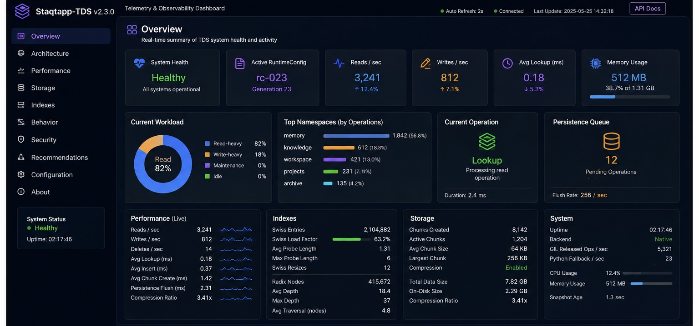

<p align="center">
    
</p>


# 🟦🟪🟧 Staqtapp-TDS v2.3.0

**Temporal Directory System** — a Python-first virtual storage layer for named Python variables, UTF-8 text payloads, semantic routing metadata, provenance tags, config generations, and observable high-throughput lookup paths.

v2.3.0 turns the admin dashboard into a real **observation layer** without making it part of the hard TDS data path.

```text
TDS Core
  Swiss index / radix / chunking / serialization / persistence
        ↓ publishes cheap counters + sampled subsystem stats
TelemetryManager
        ↓ cached snapshots
Local Browser Panel
```

The dashboard observes. It does not repeatedly scan or control hot internals.

## What is new in v2.3.0

### TelemetryManager

`TelemetryManager` records lightweight counters and timers for normal TDS work:

```text
reads / writes / lookups
lookup hits / misses
average read/write/lookup latency
raw bytes / stored bytes
compression ratio
chunks created
deletes / errors
native vs Python backend operation counts
```

Snapshot generation is cached and throttled. The default dashboard interval remains 2 seconds.

### Adaptive behavior feedback

The observation snapshot classifies storage behavior objectively:

```text
idle
read-heavy
write-heavy
balanced
```

It also exposes conservative recommendations, such as:

```text
low compression gain
Swiss probe pressure
miss-heavy lookups
```

These are recommendations only. TDS does not auto-tune itself yet.

### Dashboard upgrades

The local browser panel now displays:

```text
Reads/sec
Writes/sec
Average lookup latency
Average write latency
Compression ratio
Chunk count
Index pressure
Workload mode
Live Architecture component states
```

The panel is still local-only by default and remains a control/observer shell.

## Security/control-plane posture

Current admin/dashboard security remains development-local and intentionally minimal:

```text
localhost-bound panel
short-lived local config grants
immutable RuntimeConfig stage/promote/rollback
audit events for admin actions
no raw secrets shown
no benchmark/deep diagnostic execution from automatic refresh
```

Stronger mechanisms such as mTLS, signed config bundles, quorum approval, or air-gapped import/export remain future production-hardening layers.

## Performance boundary

The browser panel should not materially interfere with the storage engine.

```text
Hot path:
  counter/timer increments only

Snapshot path:
  cached, throttled, sampler-based

Manual diagnostics:
  explicit admin action only
```

The rule for future work is:

> Dashboard features may consume telemetry, but may not require direct access to Swiss-table, radix, persistence, or serialization internals beyond published metrics.

## Quick use

```python
from staqtapp_tds import TDSFileSystem

fs = TDSFileSystem()
fs.root.write("greeting", "hello")
fs.root.read("greeting")

snapshot = fs.observation_snapshot(force=True)
print(snapshot["performance"])
print(snapshot["behavior"])
```

Admin panel:

```bash
staqtapp-tds-admin panel
```

Then open the local URL printed by the command.

## Validation

This package was checked with:

```text
47 passed, 2 skipped
python compile check passed
```
